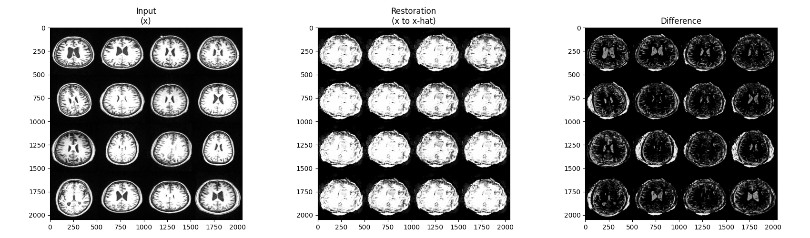
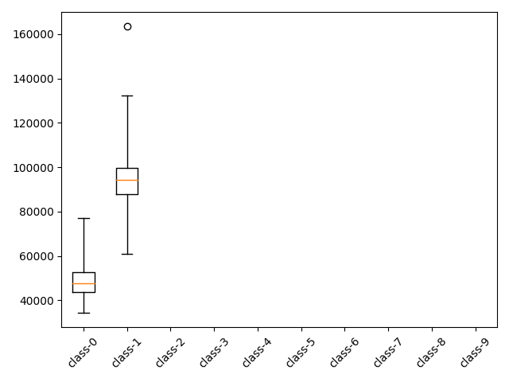

f-AnoGAN: Fast unsupervised anomaly detection with generative adversarial networks
=====

TensorFlow implementation of <a href="https://www.sciencedirect.com/science/article/abs/pii/S1361841518302640">f-AnoGAN</a> with MNIST dataset [1].  
The base model <a href="https://github.com/YeongHyeon/WGAN-TF">WGAN</a> is also implemented with TensorFlow.   

## Results

### Training Phase-1 (WGAN Training)

#### Training graph of Phase-1

#### Result of Phase-1

|z:64|z:128 (latent space walking)|
|:---:|:---:|
|||

### Training Phase-2 (izi Training)

#### Training graph of Phase-2
The front half of the graph represents the state of the training phase 1.  

|Term izi|Term ziz|Loss E (Encoder)|
|:---:|:---:|:---:|

#### Result of Phase-2

    
  
Restoration result by f-AnoGAN.

### Test Procedure

  
  
Box plot with encoding loss of test procedure.

## Environment
* Python 3.7.4  
* Tensorflow 1.14.0  
* Numpy 1.17.1  
* Matplotlib 3.1.1  
* Scikit Learn (sklearn) 0.21.3  

## Reference
Github: https://github.com/YeongHyeon/f-AnoGAN-TF
[1] Schlegl, Thomas, et al (2019). <a href="https://www.sciencedirect.com/science/article/abs/pii/S1361841518302640">f-AnoGAN: Fast unsupervised anomaly detection with generative adversarial networks</a>. Medical image analysis 54 (2019): 30-44.
